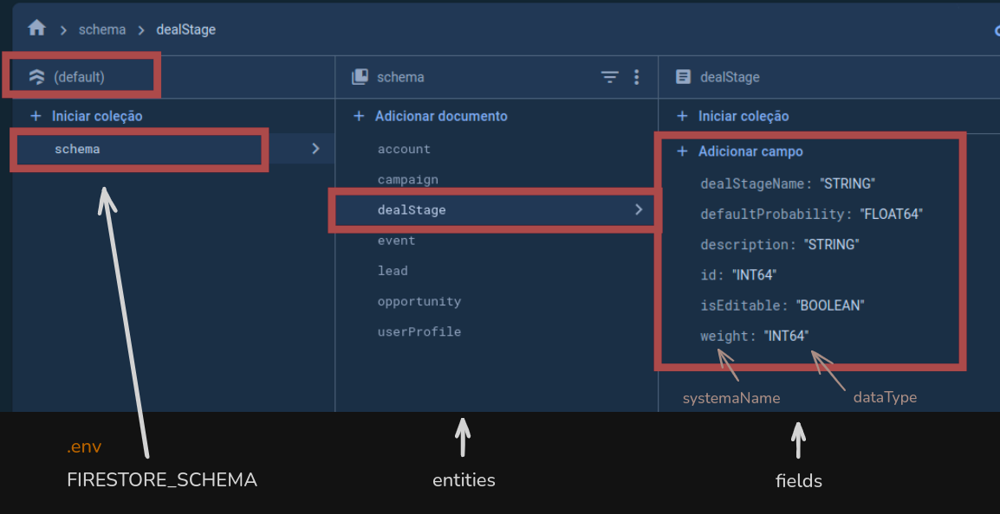
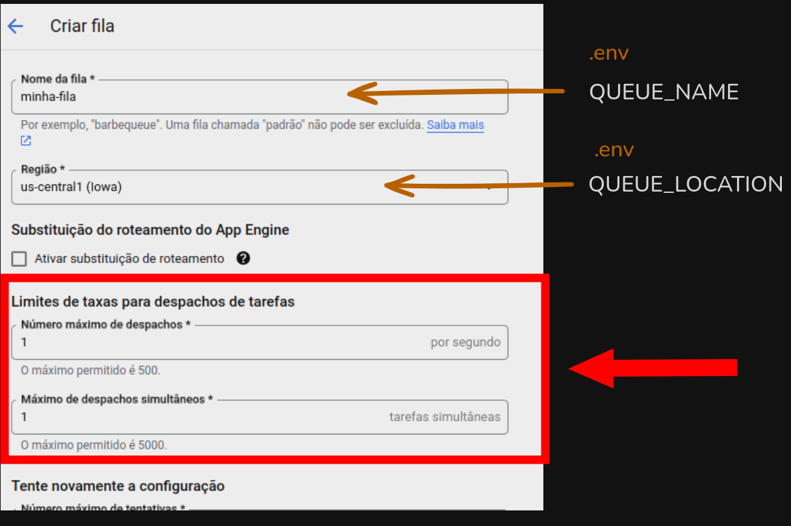

# Criar o projeto no Firebase

[Console do Firebase](https://console.firebase.google.com/)

- [ ] Fazer o upgrade para o plano Blaze para que seja possível efetuar o deploy das funções.

- [ ] O id do projeto deverá ser indicado nas variáveis de ambiente das funções (`.env`)


<br />
<br />

# Criar o banco de dados Firestore 

    IMPORTANTE: 

    O integrador considera apenas o database `default`


<br />

## Cadastrar os schemas das entidades

- [ ] Incluir uma coleção (ex.: `schema`) para registrar as entidades e campos que serão manipulados na integração. O nome da coleção deverá ser indicado nas variáveis de ambiente das funções (`.env`)


- [ ] Incluir um documento para entidade. Entidades disponíveis:

    - `account`

    - `campaign`
    
    - `dealStage`
    
    - `event` *
    
    - `lead`
    
    - `opportunity`
    
    - `userProfile`

<br />

1. O código do documento deve ser o nome da entidade.

2. Cada campo da entidade (`systemName`) deve ser 1 campo do documento com o tipo `string` e valor conforme o tipo do campo, sendo possível:


    |Tipo      | Observação         |
    |----------|--------------------|
    |INT64     | Inteiros           |
    |FLOAT64   | Decimais           |
    |TIMESTAMP | Datas              |
    |BOOLEAN   | Verdadeiro/Falso   |
    |STRING    | Todos os demais    |


<br >



<br >

####  * EXCEÇÃO

A tabela de eventos (`event`) possui 1 campo string que guarda um JSON. Este campo é convertido e desmenbrado pelo integrador. Assim, o documento `event` deve conter os campos conforme abaixo:


    | Campo             | Valor     |
    |-------------------|-----------|
    | id                | INT64     |
    | leadID            | INT64     |
    | eventName         | STRING    |
    | whatID            | INT64     |
    | whatType          | STRING    |
    | eventData         | STRING    |
    | eventSource       | STRING    |
    | createTimestamp   | TIMESTAMP |
    | amount            | STRING    |
    | caller            | STRING    |
    | callerName        | STRING    |
    | callId            | STRING    |
    | callResult        | STRING    |
    | dealStageID       | STRING    |
    | formerDealStageID | STRING    |
    | hash              | STRING    |
    | isDelivered       | STRING    |
    | isHardBounce      | STRING    |
    | isOpened          | STRING    |
    | linkClicked       | STRING    |
    | newStatus         | STRING    |
    | oldOwnerID        | STRING    |
    | opportunity       | STRING    |
    | ownerID           | STRING    |
    | previousStatus    | STRING    |
    | probability       | STRING    |
    | referrer          | STRING    |
    | taskId            | STRING    |
    | url               | STRING    |

<br />
<br />

# Tasks

- [ ] Ativar a API do [Cloud Tasks](https://console.cloud.google.com/cloudtasks)

- [ ] Criar a fila para processamento.

    A queue deve estar configurada para processar 1 único registro por vez e no máximo 1 registro por segundo

        Despachos simultâneos = 1
        Máximo de despachos = 1

- [ ] O nome da fila e a região selecionada deverão ser indicadas nas variáveis de ambiente das funções (`.env`)
 
 

<br />
<br />

# Big Query

- [ ] Ativar a API do [Big Query](https://console.cloud.google.com/bigquery)

- [ ] Criar um conjunto de dados

- [ ] O nome do conjundo de dados deverá ser indicado nas variáveis de ambiente das funções (`.env`)


<br />
<br />

# Deploy

- [ ] Seguir os procedimento da [Documentação do Firebase](https://firebase.google.com/docs/functions/get-started?hl=pt-br&gen=1st) para configurar e inicializar o projeto localmente.

    - Selecionar o projeto criado acima
    
    - Typescript

    - ESLint = Y
    
    - Install dependencies = N

- [ ] Descompactar o arquivo `source.zip` e copiar o conteúdo para a pasta `functions` do projeto

    - Sobrepor os arquivos existentes

- [ ] Instalar as dependencias

- [ ] Alterar os valores das chaves do arquivo (`functions/.env`).

- [ ] Seguir os procedimentos para deploy das funções conforme documentação do Google Fibebase/GCP.


<br />
<br />

# Uso

A publicação das funções cria os endpoints usados pelo integrador que podem ser consultados [nesse link](https://console.cloud.google.com/functions/list).

Nos detlhes de cada função pode ser consultado,m entre outras coisas, o gatilho para requisição da mesma.


### Create Table

Este recurso efetua a geração da tabela no Big Query conforme a definição cadastrada no schema.

```js
POST <your_base_url>/createTable
{
    "entity": "account"
}
```

* Efetuar uma requisição POST para cada entidade apenas 1 vez.

<br />
<br />

### Run Entity

Efetua a integração dos dados carregando as informações inseridas/alteradas na Shapspring após a data/hora da última sincronização

```js
POST <your_base_url>/runEntity
{
    "entity": "account"
}
```

* Programar a requisição para disparar em intervalos regulares para cada entidade.

* __IMPORTANTE:__ Levar em consideração o tempo de resposta e limitações de requisição da API da Sharp ao definir este intervalo.

* __OBS:__ Pode ser utilizado o [Cloud Scheduler](https://console.cloud.google.com/cloudscheduler) para a criação dos Jobs

<br />

### Restore Entity

Remove os dados da tabela e carrega todos registros novamente

```js
POST <your_base_url>/restoreEntity
{
    "entity": "account"
}
```    

* __IMPORTANTE:__ Dados que estejam no buffer do stream não podem ser apagados: [Cannot update or delete over BigQuery streaming tables](https://cloud.google.com/knowledge/kb/cannot-update-or-delete-over-bigquery-streaming-tables-000004334).


<br />

### Entity Integration

Usado pelo gerenciador de filas para processar as requisições em  blocos

```js
<your_base_url>/entityIntegration
```    

<br />
<br />

# Views

Por conta do buffer de dados que limita a alteração de registros [ver documento](https://cloud.google.com/knowledge/kb/cannot-update-or-delete-over-bigquery-streaming-tables-000004334), os dados sempre são inseridos na tabela do Big Query com a coluna updated_at com o timestamp do momento da carga.

Desta forma, para que sejam sempre recuperados os dados mais atualizados, é necessário que sejam criadas views:

### Exemplo view dealStage


```sql
SELECT      
  tab.id                    AS id,
  tab.dealStageName         AS deal_stage_name,
  tab.description           AS description,
  tab.defaultProbability    AS default_probability,
  tab.weight                AS weight,
  tab.isEditable            AS is_editable  
FROM 
  `<project>.<dataset>.dealStage` as tab 
WHERE 1 = 1
  AND tab.updated_at = (SELECT MAX(updated_at) from `<project>.<dataset>.dealStage` AS cur
                        WHERE 1 = 1
                          AND cur.id = tab.id
                       )
```
